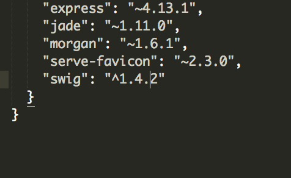
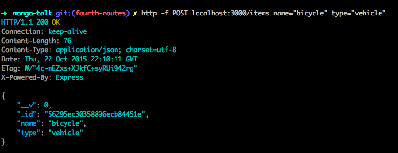
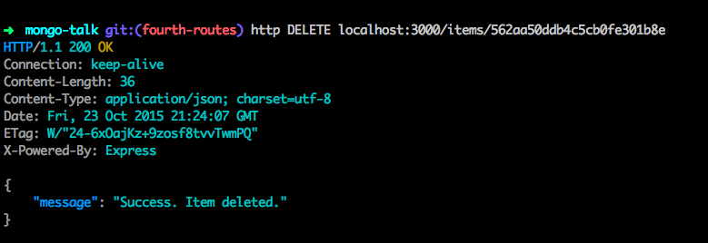

## MongoDB Crud App Tutorial

This tutorial tackles a vital programming fundamental, **CRUD**. Nearly every single application on the web today creates and manipulates data as a core part of its functionality. My goal with this lesson is to get a beginner developer with a basic understanding of the command line, HTML, CSS, JavaScript and an interest in the MEAN stack to take a massive step towards the professional coding. This is not going to address all aspects of serverside code, but it will shed some light project setup, routes and MongoDB.   

#### NodeJS

Install NodeJS, go [here](https://nodejs.org/en/).

This will also install [NPM](https://docs.npmjs.com/getting-started/what-is-npm), which is a vital brick in your new path as a MEAN stack developer.

Some key words related to this topic that you may want to look up:

*package.json
*dependencies


#### Express Generator

We continue by installing the Express Generator via NPM. This will provide the basic project structure for our app. If this is your first web app, these files might be a little daunting. **Thats fine. 'Slowly but surely' should be your motto.** We will tackle some of the basics and leave some others for another time. 

`npm install -g express generator`

`brew install httpie` - we'll use this later

If you don't have home brew installed, go [here](http://brew.sh/). 

Home brew, much like NPM, is a service that makes downloading and installing packages or small programs via the command line a breeze. 

### Initital Project Structure 

>branch: first-generator

Anytime you start a new project, create a new directory to hold all of the files related to that project.

Make a new directory:

`mkdir mongo-crud && cd mongo-crud`


Then run the express generator:

`npm express-generator`

The project structure we just created looks like this:

```
├── app.js
├── bin
│   └── www
├── package.json
├── public
│   ├── images
│   ├── javascripts
│   └── stylesheets
│       └── style.css
├── routes
│   ├── index.js
│   └── users.js
└── views
    ├── error.jade
    ├── index.jade
    └── layout.jade
```

Get familiar with this layout as it is super common in application development.

### Refactor with Swig

> branch: second-swig

A 'templating language' provides a syntax for making more dynamic html pages. Jade is a very common 'templating language' used with the MEAN stack. I like using 'swig' intead, a personal choice. Lets convert this app from 'jade' to 'swig'. 

Add this to your package.json
`'swig': '^1.4.2'`



/mongo-talk/public/images/packagejson-swig.png

Run `npm install`.

We just used NPM to install a 'package'. NPM knows to look for the `package.json` file, which was created for us in the express generator build. 

In app.js remove:

``` javascript
app.set('views', path.join(__dirname, 'views'));
app.set('view engine', 'jade');
```

In that same spot in app.js, add:

```	javascript
var swig = require('swig')

var swig = new swig.Swig();
app.engine('html', swig.renderFile);
app.set('view engine', 'html');
```

This is the first look at the app.js file. This is the heart of our application. In here we set the basic behavoir and make availble the neccesities needed to run the app. 

In the **views** folder remove the all files and add: **layout.html**, **index.html**

Cut and paste this code into the layout.html:

``` html
<!DOCTYPE html>
<html>
  <head>
    <meta charset="utf-8">
    <title>{{ title }}</title>
    <link rel="stylesheet" href="//netdna.bootstrapcdn.com/bootstrap/3.3.5/css/bootstrap.min.css">
    <link rel="stylesheet" href="/css/main.css">
  </head>
  <body>
    
    
    <script type="text/javascript" src="//code.jquery.com/jquery-2.1.4.min.js"></script>
    <script src="https://maxcdn.bootstrapcdn.com/bootstrap/3.3.5/js/bootstrap.min.js"></script>
    <script type="text/javascript" src="/js/main.js"></script>
  </body>
</html>

```

This the foundation of all of our html pages and we can include content from other html files using the 'swig' syntax.

Cut and paste this into your index.html:

```







  <div class="container">

    <h1>{{ title }}</h1>
    <p>Welcome to {{ title }}</p>

  </div>



```

Look at the ``. That is saying, "This code will be wrapped in the layout.html file". Don't be too concerned now with this, as our focus here is the serverside code of this CRUD app. Onward!


In the terminal, in the root of the project directory (mongo-crud), run: 

'npm start' 

If everything is set up correctly you should see:


Those were all modifications dealing with how our page renders html files. We are now going to setup our app's database, MongoDB with the Mongoose framework.

### Set Up MongoDB with Mongoose

> branch: third-mongodb

Start by installing Mongo and Mongoose:

`npm install mongodb -g`

This installed MongoDB on your whole machine so you can use it with all your MEAN projects, no need to run this command again.

`npm install mongoose --save`

This installed mongoose 'locally', meaning only for this project. This concept of global and local is important. Have a look at the package.json file. We now have mongoose in our dependencies. If it is in your package.json file, then it is installed specifically for this project. 

Keep thinking about local and global as you create more projects, it will become more clear as you make more code. For now, just know that NPM installs packages for use both on your computer (global) and/or within specific projects (local).


Lets look at the MongoDB through our terminal.
In the command line type `sudo mongod`, then  enter your computer password. This will start the MongoDB daemon running. Now open a new tab and type `mongo`. This is the command line interface for mongoDB. Enter the command `show dbs`. This will show any databases that you have created. If you are using mongo for the first time there will be nothing listed. We are going to change that by the end of this project.


Next add a new file, 'database.js' to the root directory.

In database.js add the following code:

```
// bring in mongoose and grab the Schema constructor
var mongoose = require('mongoose');
var Schema = mongoose.Schema;


// create new Schema, setting keys and value types
var itemSchema = new Schema ({
	name: String,
	type: String
});

// create a model, which holds all of our Items
var Item = mongoose.model('items', itemSchema);

// set up the connection to the local database, if it doesn't exist yet one will be created automatically
mongoose.connect('mongodb://localhost/mongo-item');

// make the Item Schema available to other files
module.exports = Item;


```
This has setup our database with a format in which to store our data, aka the **'Schema'**. Created a place for all the data to be gathered, the **'model'**, and established a connection to the database, the **'connection'**.

We have set both of our fields up to accept strings. If we try to put a number or an object or an array, it will reject it. In most cases it is valuable to specify the type of data going into the database for consisntency reasons. On the other side of the coin, MongoDB allows for different data types to be passed in to the same field, which if used properly, is a very powerful tool.

Possible schema value types:

* String
* Number
* Date
* Buffer
* Boolean
* Mixed
* Objectid
* Array

More info on Mongoose Schemas [here](http://mongoosejs.com/docs/schematypes.html).

### CRUD Routes

What is CRUD?

* Create
* Read
* Update
* Delete

These are the basic operations that an app needs to perform when handling data. You may have heard of a RESTful API, which is similar, but with specific philosiphies applied that are out of the scope of this tutorial. For more information go [here](http://www.restapitutorial.com/lessons/whatisrest.html). As a programmer, if you can elegantly handle these actions then you are well on your way to turning your skills into a paycheck. 

Let's begin with our index.js file.

In index.js we need to require our database file to get access to the Schema:

``` javascript
var Item = require('../database.js');
```

The standard setup that our express generator provided has 'express' required in our `index.js` and then sets the variable `router` to an instance of an express router object. This object will handle the transfering/serving of data as called for by our HTTP requests. The router object includes functions that we can call to acheive our basic CRUD operations. When we define these CRUD operations using the router instance, we are creating routes. I think of them as pathways for data between our browser/server and the database. So, lets get to it.

#### READ

We need to be able to read or get all of the Items from the database.

```
// call the GET method, and define an anonymous function
router.get('/items', function(req, res, next) {

// instantiate a new Item with the values supplied by the request  
	Item.find({}, function(err, data){

// handle an error
		if (err) {
			res.json(err);
		}
// handle an empty database 
		else if (data.length===0) {
			res.json({message: 'There are no items in the database.'});
		}
// if there are Items, return them	
		else {
			res.json(data);
		}
	});
});
```

There is a TON going on in there and if you are new to routes, it is really intimidating. I broke it down it down somewhat in the comments, but we can dig deeper. 

After we call `router.get` we define the URL path, in this case `/items`. Our app will use this 'path' to utilize the `GET` functionallity of the app.

Let me show you what I mean with that 'httpie' we installed earlier. In the terminal fire up the database using `sudo mongod`, and also the server using `npm start`. Now run:

```

http GET localhost:3000/items

```

You should see this:


You can see in the second line `HTTP/1.1 200 OK`. This means our route was successful and that the logic in our route was executed. You can confirm that this logic was correct becuase it returned "There are no Items in the database." in 'json' format. We'll come back and test this some more after we create some Items. 


First, lets change the route path to illustrate a point. Run:

```

http GET localhost:3000/things

```

You should see this: 


We used a 'path' that was undefined, so there was nothing for the browser/server to do. There was no route to handle the browsers/servers request. This is a 404 error. They are common in devopling and tell you that you need to investigate your routes or paths.

OK, back to the CRUD.

#### CREATE

We need to be able to create information and add or `POST` it to our database. 

```javascript
// call the post method, and define an anonymous function
router.post('/items', function(req, res, next) {

// instantiate a new Item with the values supplied by the request  
	var newItem = new Item({name: req.body.name, type: req.body.type});

// save the new item using a mongoose function
	newItem.save(function(err, data){
// handle an error 
		if (err) {
			res.json(err);
		}
// no error, then return the data in the json format
		else {
			res.json(data);
		}
	});
});

```

Have a look at the `req.body`. 'req' stands for 'request'. It is an object sent by the browser/server with properties that we can access. We are grabbing the 'body' property and getting its values to instantiate our new Item.

Now we will test this out with httpie in the terminal. Run:

```
http -f POST localhost:3000/items name="bicycle" type="vehicle"

```

You should see this:




Ok, awesome, we can create new Items. Lets look a little closer at that json object that came back. It has a 'name' and 'type' property which we should expect. But it also has '_id' and '_v'. We won't worry about the latter in this tutorial, but I do want to look at the former.

'_id' is a unique id created by Mongo when a new item is saved. It will always be unique, always. This is important and it is extremely useful.  A couple use cases are finding documents in your database, or diferentiating between two similar documents.  

We are going to put it to work in our 'update' route.

#### UPDATE

```
router.put('/items/:id', function(req, res, next) {
	var id = {_id: req.params.id};
	var update = {name: req.body.name, type: req.body.type};
	var options = {new: true};

	Item.findOneAndUpdate(id, update, options, function(err, data){
		if (err) {
			res.json(err.message);
		}
		else {
			res.json(data);
		}
	});
});

```

You should see this:


Look at the path we defined for this route. 

`/items/:id`

The `:id` allows us to pass in a value with the URL and recieve it on the otherside via the request object. You can see in the logic of the route we are grabbing that id with via `req.params.id`. The variable name you put after the colon is the variable name you will use to access the value within the route. pretty cool. This means we have two ways to pass info to the route: 

1 via the URL, req.params
1 via the body (possibly in a form), req.body

In this route we used both to gut our update accomplished. There are many different ways to utilize this functionality and how you implement it will come down to the specific project needs.

#### DELETE

And for our final trick, delete.

```
router.delete('/items/:id', function(req, res, next) {
	Item.findOneAndRemove({_id: req.params.id}, function(err, data){
		if (err) {
			res.json(err.message);
		}
		else if (data.length===0) {
			res.json({message: 'An item with that id does not exist in this database.'});
		}
		else {
			res.json({message: 'Success. Item deleted.'});
		}
	});
});

```

If all goes well you will see this:




This completes the server-side code for our basic crud app. Wow, that was huge. Don't worry if you don't understand it all completely. Sleep on it. And do it again, as much from memory as possible. Maybe next time, depending on the outcome of the request/respponse send a custom messages back to the user. Change up the Schema to be houses with colors, or cars with years, or friends with phone numbers and birthdays. The CRUD app is essential to you as a programmer, get real familiar with all of its parts. Another great tutorial on NodeJS basics is [Getting Started with Node](http://mherman.org/blog/2014/02/16/getting-started-with-node/#.Vil7IhCrRE4) by my friend Michael Herman. Check it out!

In PART 2 of this tutorial we will sync up the front end so that a user can use the browser to access all of our beautiful CRUD routes to create and manipulate data.

Thanks for reading.


